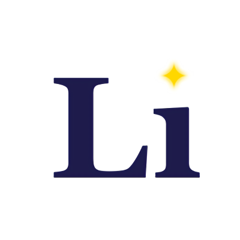

<p align="center">
  
</p>

# Light island

"累上流云借月章" — _Dumbliidore_

基于 [Zensical](https://zensical.org) 构建的个人博客。

## 命名

`Light island`，出于中文谐音以及 `Lighthouse` 的拆分重组，把 `house` 替换成了更大的 `island`。对我而言，像是在一座人迹罕至的岛屿上面，以星光为灯，翻开了一本尘封的书。

## 本地开发

```bash
# 安装依赖
uv sync

# 启动开发服务器
uv run zensical serve

# 构建静态站点
uv run zensical build
```
