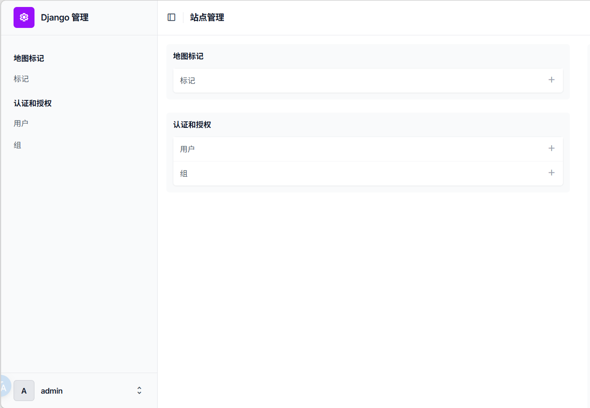
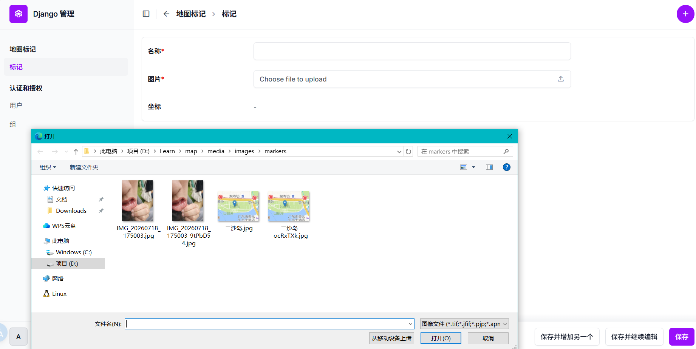

# Django制作地图

## 摘要

基于Django、Pillow和Leaflet制作的地图展示，可以理解为参考文章的”引进版“。由于大部分功能在参考文章中已经实现，故在此不多赘述，只介绍一些新的部分和改动，以及一些注意事项。

## 参考文章

[Maps with Django⁽¹⁾: GeoDjango, SpatiaLite & Leaflet](https://www.paulox.net/2020/12/08/maps-with-django-part-1-geodjango-spatialite-and-leaflet/)  
[Maps with Django⁽²⁾: GeoDjango, PostGIS & Leaflet](https://www.paulox.net/2021/07/19/maps-with-django-part-2-geodjango-postgis-and-leaflet/)  
[Maps with Django⁽³⁾: GeoDjango, Pillow & GPS](https://www.paulox.net/2025/04/11/maps-with-django-part-3-geodjango-pillow-and-gps/)

## 依赖

项目使用`uv`进行依赖管理，安装的依赖如下：

- django
- django-leaflet>=0.33.0
- pillow>=12.3.0
- django-unfold>=0.100.0
- GDAL

`django`安装最新版即可，其中`GDAL`需要单独安装，安装自己电脑系统和版本进行安装

## GDAL

在安装`django`和`gdal`之后，根据`django`官方文档需要在`settings.py`中进行设置

```python
VENV_SITE_PACKAGES = BASE_DIR / ".venv" / "Lib" / "site-packages"

proj_ltb = VENV_SITE_PACKAGES / "osgeo" / "data" / "proj"
os.environ["PROJ_LIB"] = proj_ltb.as_posix()

GDAL_LIBRARY_PATH = VENV_SITE_PACKAGES / "osgeo" / "gdal.dll"
GEOS_LIBRARY_PATH = VENV_SITE_PACKAGES / "osgeo" / "geos_c.dll"
```

## 一些改动

使用了`django-leaflet`替代了`leaflet.js`，所以一些地方需要进行修改

### settings.py

```python

LEAFLET_CONFIG = {
    "DEFAULT_CENTER": (23.1291, 113.2644),
    "DEFAULT_ZOOM": 12,
    "MIN_ZOOM": 3,
    "MAX_ZOOM": 18,
    "TILES": [
        (
            "高德街道",
            "https://wprd0{s}.is.autonavi.com/appmaptile?x={x}&y={y}&z={z}&lang=zh_cn&size=1&scl=1&style=7",
            {
                "subdomains": "1234",
                "attribution": "&copy; 高德地图",
            },
        ),
        # 高德卫星影像
        (
            "高德卫星",
            "https://wprd0{s}.is.autonavi.com/appmaptile?x={x}&y={y}&z={z}&lang=zh_cn&size=1&scl=1&style=6",
            {
                "subdomains": "1234",
                "attribution": "&copy; 高德地图",
            },
        ),
    ],
    "DEFAULT_TILES": "高德街道",
}
```

需要注意的是，参考文章中使用的`OpenStreetMap`瓦片源无法显示，这里替换成了国内的高德瓦片源。

### map.html

```html
 
<!doctype html>
<html lang="en">
  <head>
    <title>Markers Map</title>
    <meta name="viewport" content="width=device-width, initial-scale=1.0" />
     
    <style>
      body {
        margin: 0;
        padding: 0;
      }
      html,
      body,
      #map {
        height: 100%;
        width: 100vw;
      }
      figure {
        margin: 0;
        padding: 0;
        text-align: center;
      }
      img {
        max-width: 100%;
        height: auto;
      }
    </style>
  </head>
  <body>
    {{ markers|json_script:"markers" }}
    <script src=""></script>
    
  </body>
</html>
```

### map.js

相对应的`js`也需进行修改

```javascript
window.map_init = function (map, options) {
  const data = JSON.parse(document.getElementById("markers").textContent);
  const feature = L.geoJSON(data)
    .bindPopup(
      function (layer) {
        const name = layer.feature.properties.name;
        const img = layer.feature.properties.image;
        if (!img) return name;
        return (
          "<figure>" +
          '' +
          "<figcaption>" +
          name +
          "</figcaption>" +
          "</figure>"
        );
      },
      // 设置图片的最小宽度
      { minWidth: 200 },
    )
    .addTo(map);

  const bounds = feature.getBounds();
  if (bounds.isValid()) {
    map.fitBounds(bounds);
  }
};
```

## 新增

添加了`unfold`作为后台`admin`，具备现代化和美观

### settings.py

将`unfold`添加到`INSTALLED_APPS`最上面

```python
INSTALLED_APPS = [
    "unfold",
    "django_cotton",
    "django.contrib.admin",
    "django.contrib.auth",
    "django.contrib.contenttypes",
    "django.contrib.sessions",
    "django.contrib.messages",
    "django.contrib.staticfiles",
    "django.contrib.gis",
    "leaflet",
    "markers",
]
```

### admin.py

```python
from django.contrib import admin
from leaflet.admin import LeafletGeoAdmin
from unfold.admin import ModelAdmin

from markers.models import Marker


@admin.register(Marker)
class MarkerAdmin(LeafletGeoAdmin, ModelAdmin):
    list_display = ("name", "image")
    readonly_fields = ("location",)
    search_fields = ("name",)
```

这里使用了`LeafletGeoAdmin`，而不是使用`GISModelAdmin`，也避免了与`unfold`的冲突。

### apps.py

该文件需要在`markers`目录下新建，主要为了后台中文展示

```python
from django.apps import AppConfig


class MarkersConfig(AppConfig):
    name = "markers"
    verbose_name = "地图标记"

```

### models.py

添加了中文，方便后台使用

```python
from django.contrib.gis.db import models
from django.core.validators import FileExtensionValidator
from django.db.models import Manager

from markers.utils import get_point


class Marker(models.Model):
    objects: Manager

    name = models.CharField(max_length=200, verbose_name="名称")
    location = models.PointField(verbose_name="坐标")
    image = models.ImageField(
        verbose_name="图片",
        null=True,
        upload_to="images/markers/",
        validators=[
            FileExtensionValidator(allowed_extensions=["jpg", "jpeg"]),
        ],
    )

    class Meta:
        verbose_name = "标记"
        verbose_name_plural = "标记"

    def __str__(self):
        return str(self.name)

    def save(self, *args, **kwargs):
        if self.image:
            point = get_point(self.image)
            if point:
                self.location = point
        super().save(*args, **kwargs)

```

### 界面效果




其实该项目比较简单，使用`django`自带的`admin`足以，因为之前没用过这个后台，为了后续项目的开发，提前用这个项目对`unfold`做了测试，感觉还不错。

## 地图展示


## 结论

由于从事相关GIS行业，想着自己实现一次地图展示的功能，凭借对`django`的理解，根据国外文章进行的`二次实现`，实现了使用`django`进行地图的展示。其中用`django-leaflet`替换`leaflet`以及用`unfold`进行后台的美化，只是在原项目上一些微不足道的改动，也是对心中想法的一次尝试。

---

??? note "参考资料"

    - [Django Stable Document]([https://...](https://docs.djangoproject.com/zh-hans/6.0/))
    - [django-leaflet Document]([https://...](https://django-leaflet.readthedocs.io/en/latest/))
    - [Unfold Document]([https://...](https://unfoldadmin.com/docs/))
