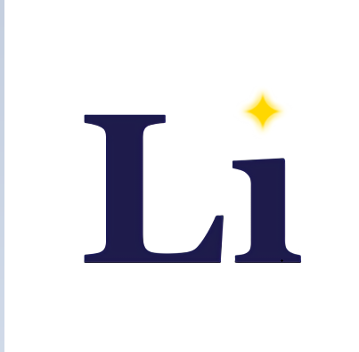

# Hello world

## 缘由

&emsp;&emsp;打算重拾博客，于是找到了之前偶然看到的`zensical`，看了文档发现它挺合我的胃口，简洁、自定义、插件丰富以及配置简单，于是就决定用它了。

## 命名

&emsp;&emsp;`Light island`，出于中文谐音以及`Lighthouse`的拆分重组，把`house`替换成了更大的`island`。对我而言，像是在一座人迹罕至的岛屿上面，以星光为灯，翻开了一本尘封的书。

## 图标

  
&emsp;&emsp;博客名称的首字母组合。图标是由我亲手创作（:smile:AI）的,在创作过程中发现其正好是我爱人的姓的拼音。给博客命名时我是没有觉察到的，单纯出于谐音与对未来的期望，没想到收获了一个美丽的巧合，实在让人欣喜。
